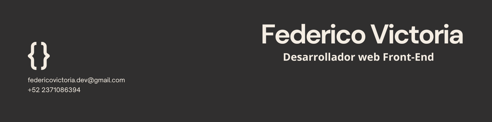

# Hola soy Federico Victoria 
## Desarrollador Front-End

 

### Te cuento algo de mi

Soy un desarrollador front-end apasionado por crear experiencias de usuario intuitivas y atractivas. Me especializo en tecnologías web modernas y siempre estoy buscando aprender y mejorar mis habilidades.